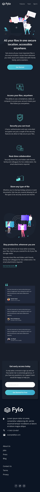

# A Landing Page for Fylo

This project is a way of encouraging people to use css grid features to create dynamic layout.

CSS grid is a game changer, It replaces float layout, and allows you to write less and more readable and logical HTML/CSS. It also works perfectly together with flexbox, which is best to handle one-dimensional components and layout.

To dive deeper, I suggest checking out Resources by [Rachel Andrew](https://twitter.com/rachelandrew) and [Jen Simmons](https://twitter.com/jensimmons).

This project is open to contributions!

## LIVE PREVIEW
### https://fylo-landing-page-web.netlify.app/

## Design
This design Inspiration was derived from the images below for both Desktop and mobile devices.

###### Desktop View


###### Mobile View



## Images
Images used in this project were gotten from Unsplash. I suggest checking out [Unsplash](https://unsplash.com/)
svg icon used, were gotten from [IcoMoon App](https://icomoon.io/app/#/select) from their free libaries.


## Setup Instructions

### Sass need to be installed locally on your computer to get you starting.
Starting the project runs a local server, watches Sass files, builds Sass to CSS and live reloads.
 
 ```
 install node.js
 ```
Helps you to write tools for local development.
 
 ```
 npm install 
 ```
  Manages packages on your local computer, for development.

  ```
  npm run start
  ```
  for development process.

  ```
  npm run build
  ```
  run all task for production.


